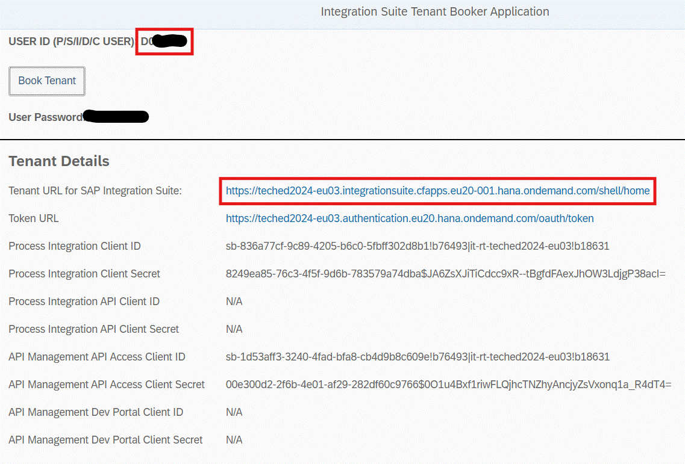

# Pre-requisites

Here is a list of requirements which you have to full fill before you start doing the excercises. 

## SAP IBP

1. Make sure you have a valid license to use SAP IBP. Also check if your user has the permissions to create a communication arrangement, communication system and communication user.
2. You need a planning area which is configured for demand planning. This requires you to be proficient in time series data in SAP IBP. You can also use a sample planning area for this purpose. 
3. Cross check if you have some master data for Products, Location, Customer, Unit of measure as well as some time series data such as Sales (e.g. ACTUALSQTY) or Demand forecast (e.g. CONSDEMANDQTY).

## SAP Integration Suite

1. You can create a user using the [TechEd Tenant Booker Application](https://techedtenantbookerapplication-ad5b9d48b.dispatcher.hana.ondemand.com/index.html) for the test SAP Cloud Integration tenant which can be used for this excercise. Utilize your S-user, D-user or I-user to create your user. If you missed to save the tenant url, credentials, no problem - you see the same data again if you re-open the app. Navigate from the booker tool to the Integration Suite instance you are assigned to by clicking the corresponding link (marked in red on the snapshot below). Optionally you can bookmark the opened Integration Suite url for later direct access.
3. Save your user ID, password as well as the oAuth credentails which you would need to trigger the iFlows from a HTTPs client such as Postman or Bruno.

<b>Remember</b>:- <ul>
    <li>The system access for the participants will be open till <b>25.10.2024 EOB (Walldorf, Germany timezone)</b> only.
    <li>If you need assistance later on in one of the steps of the exercise please provide your user ID and the tenant (both marked in red below), so that we can find your content  </li>
    <li>You would not be able to access the BTP sub account for this test tenant.</li> 
    <li>You have to use your own sub account to create destinations for your SAP IBP instance and communication setup. We will do the these steps in the [Exercise 1 - Environment Setup - 1](../ex1/README.md). You can repeate these steps on your own SAP Cloud Integration tenant for which you have SAP BTP Cockpit access.</li>
</ul>

## Staging data

Snowflake refers to the location of data files in a cloud storage as a stage. We need to use this staging location to load bulk data into Snowflake. [Overview of data loading](https://docs.snowflake.com/en/user-guide/data-load-overview) gives you an idea of different options, you have to create these external stages.

1. You need an account on one of the following Hyperscalers :- Amazon Web Services or Microsoft Azure or Google Cloud Platform for storing data. In case of Amazon Web Services - use S3 as a storage. On Microsoft Azure - use Azure Blob store and on Google Cloud Platform use Big Query as your storage. 
2. Make sure you save the oAuth credentails for these. In this example, we will be using AWS S3 buckets as a staging location. Hence you would need the S3 Bucket ID, your Access Key and the Secret Key for S3 from your AWS IAM service. Alternatively, you can also create one using the SAP Object Store from the BTP Service and select AWS S3 standard plan. 

## Snowflake

You need a Snowflake account to do these excercises. You can also complete these with a trial account on Snowflake at the moment. You need admin rights on your account. We will do the following steps in the [Exercise 2 - Environment Setup - 2](../ex2/README.md)
1. Create a database on a schema and remember these details. In our excercise we use the PUBLIC schema and a database name - TEST_DB.
2. Also create an external stage using the [Snowflake documentation](https://docs.snowflake.com/en/user-guide/data-load-overview). In this example, we use AWS S3 bucket as an external stage. In Snowflake we created an Amazon S3 external stage by following [the steps described here](https://docs.snowflake.com/en/user-guide/data-load-s3)

After completing these steps you will have....

1.  An account to use SAP IBP.
2.  SAP Integration Suite - Cloud Integration tenant access.
3.  Stage to store bulk data either on Amazon S3, Microsoft Azure Blob store or Google's Big Query.
4.  Snowflake account with a database as well as an external stage. 

## Checklist
1. SAP BTP account
2. SAP IBP account with 
    - 2.1. permissions to manage communication setup
    - 2.2. SAP IBP Planning area with master data and keyfigure definitions
3. SAP Object store or your own staging location based on the requirements from Snowflake
4. Permissions on SAP BTP to create your destinations.
5. SAP Cloud Integration tenant with permissions to create Secure parameters and edit iFlows
6. Snowflake account with 
    - 6.1. roles to create tables, stages and monitor queries.
    - 6.2. warehouse to use Snowflake database

## Summary

After these pre-requisites are done, Continue to - [Exercise 1 - Environment Setup - 1](../ex1/README.md)
